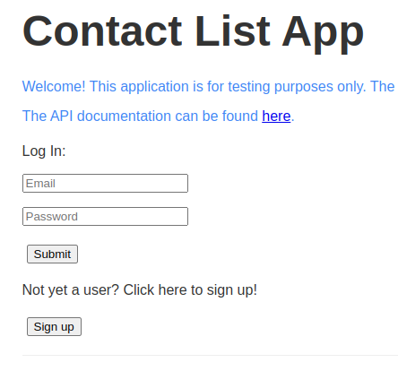
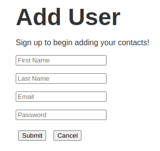
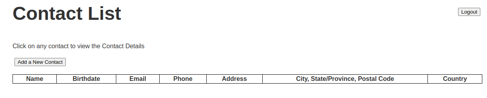

# UI Test Automation with Serenity BDD

An example UI Test Automation using Serenity, Cucumber and the Page Object Model.


<!--ts-->
* [UI Test Automation with Serenity BDD](#ui-test-automation-with-serenity-bdd)
   * [Application under Test](#application-under-test)
   * [Example Scenario to Automate](#example-scenario-to-automate)
      * [Login Page](#login-page)
      * [Add User Page](#add-user-page)
      * [Contact List](#contact-list)
   * [Running the tests under Maven](#running-the-tests-under-maven)
   * [Viewing the reports](#viewing-the-reports)
   * [Resources](#resources)

<!-- Created by https://github.com/ekalinin/github-markdown-toc -->
<!-- Added by: rashad, at: Sat Feb 17 06:26:41 PM EST 2024 -->

<!--te-->

## Application under Test

We will be testing the [Thinking Tester Contact List App](https://thinking-tester-contact-list.herokuapp.com/) `CLA` for short.

## Example Scenario to Automate
Our test covers the specific workflow of opening the login page, creating a new user and logging out.

### Login Page


### Add User Page


### Contact List


## Running the tests under Maven

To run the tests with Maven, open a command window and run:

```
./mvnw clean verify
```

## Viewing the reports

Serenity test reports are located in the `target/site/serenity` directory.

## Resources

Hopefully soon we will have a Youtube demo and Blog tutorial posted.
